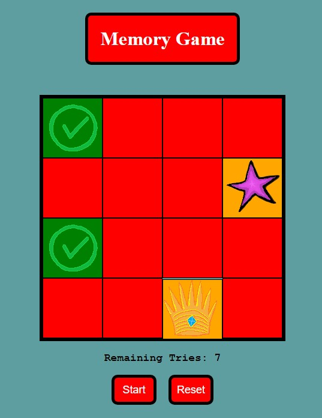

# Memory Game
The objective of this project was to create a game using JavaScript, CSS, and HTML.

The game generates a board of tiles each with its own hidden symbol. Each symbol has a pair. The player must match every pair of symbols together to win. The player is only allowed a certain number of incorrect guesses before they lose. 

## Motivation
This is the final project of the first module of my Software Engineering bootcamp. 

### The requirements for this game were:

1. Must be 2 players (either against the computer or against another player).
1. A win state - a way for the player to win the game.
1. A lose state - a way for the player to lose the game.
1. A way to keep playing if the game is not over.
1. Multiple rounds to play - a round must begin, end, and there must be a way to check if the game should continue or the overall game is won or lost.
### Stretch Goals (Not Mandatory):
- A way to reset the board and play again
- CSS to give your game a personal and fun style
- Responsive mobile design

## Screenshot
Here is a sample of the game in action:  

## Framework

Built with VS Code  
Images created in Paint 3D

## Features
- This game uses JavaScript to create an underlying logic board to interact with the visual game board seen in the HTML. This approach allows the tiles to be randomly positioned allowing for infinite replayability.

- The logic board is stored in an array and is randomly shuffled using the Fisher-Yates sorting method.

- The visual elements of the game are manipulated by CSS classes and by injecting in-line style tags for the individual background images. These images were created as .PNG files to allow for transparent backgrounds.

- The game uses logic gates, event listeners, and CSS to enforce the rules and prevent inproper solve cases for matching tiles. Example: Clicking the same tile would count as a match because every tile has the same key as itself. Adding **pointer-events: none;** to the .selected CSS class prevents this from happening.
### Not Yet Implemented: 
- Device scaling: The game is currently coded using fixed pixel amounts. A size of **400 x 400 pixels** was chosen to support most mobile devices vertically. The game could be scaled by changing the units of CSS boxes from **pixels** to a dynamic unit like **em** or **fr**.
- More Tiles: Currently the game is fixed to generate 16 tiles, however, the code was created such that any number of new symbols can be added to the array. The variable `keyArray` stores the keypair (logic) and symbol (image) in objects that will be generated into pairs of tiles using the `generateLogicBoard()` and `generateTiles()` functions. All that is required is to add more objects to the keyArray and scale up the size of the `.game-window` to align them into a square.

## Installation
This game is hosted on GitHub Pages. [Follow this link](https://dominicjunik.github.io/mod1-project/) and press start to play.

## Credits
The Fisher-Yates Shuffle was found [here](https://stackoverflow.com/questions/2450954/how-to-randomize-shuffle-a-javascript-array)

[This Project](https://marina-ferreira.github.io/tutorials/js/memory-game/) provided inspiration for the logic gates to limit the `'click' - eventListeners`. Some of the cool features that they used that were not in my game were: 
- `transform: rotateY(180deg)` to visually *flip* the game tiles
- The `data-` CSS class to store game logic information on the `html 
` tiles themselves
- using a randomly generated CSS `order` on each tile to randomize their `flexbox` position. 

